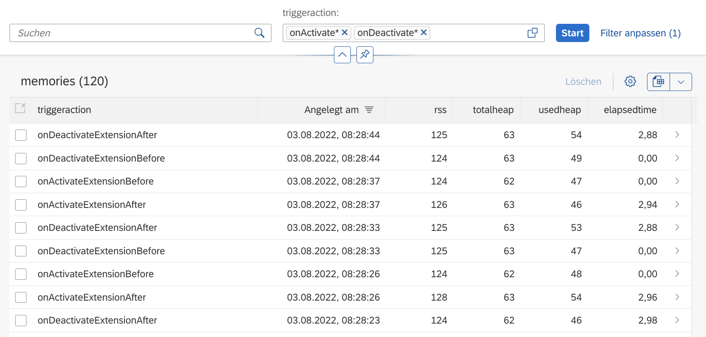
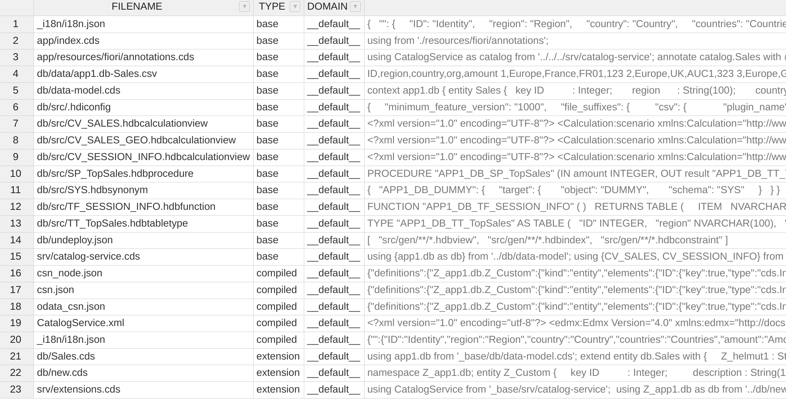

<!-- START doctoc generated TOC please keep comment here to allow auto update -->
<!-- DON'T EDIT THIS SECTION, INSTEAD RE-RUN doctoc TO UPDATE -->
**Table of Contents**  *generated with [DocToc](https://github.com/thlorenz/doctoc)*

- [app-mtx - Basic CAP App (old multitenancy)](#app-mtx---basic-cap-app-old-multitenancy)
  - [Just run the app](#just-run-the-app)
  - [Project structure](#project-structure)
  - [Build and Deploy the app](#build-and-deploy-the-app)
  - [Configuring and running the app](#configuring-and-running-the-app)
    - [Configuration](#configuration)
      - [Configuring destination](#configuring-destination)
    - [Running the app](#running-the-app)
      - [Running on BTP](#running-on-btp)
        - [Assign role collections to users](#assign-role-collections-to-users)
        - [Debug on BTP](#debug-on-btp)
      - [Running on local PC (debugging)](#running-on-local-pc-debugging)
        - [Load app environment](#load-app-environment)
          - [Load app environment for srv app](#load-app-environment-for-srv-app)
          - [Load app environment for ui app](#load-app-environment-for-ui-app)
          - [Adjust app environment for ui app](#adjust-app-environment-for-ui-app)
        - [Start the srv app](#start-the-srv-app)
        - [Start the ui app](#start-the-ui-app)
  - [Description UI layer](#description-ui-layer)
    - [Fiori](#fiori)
      - [Sales app](#sales-app)
      - [Memory monitoring app](#memory-monitoring-app)
    - [HTML5](#html5)
  - [Business logic](#business-logic)
    - [Business logic in CatalogService](#business-logic-in-catalogservice)
  - [Internals of mtx with CAP](#internals-of-mtx-with-cap)
    - [Upgrade Base Model](#upgrade-base-model)
  - [Troubleshooting / Hints](#troubleshooting--hints)
    - [~~Metadata not updated after redeployment of app~~](#metadata-not-updated-after-redeployment-of-app)
    - [When working on local PC I get [ERROR] GET - /v1/service_offerings - Query: {"fieldQuery":"catalog_name eq 'hana'"} - Could not fetch access token Request failed with status code 401](#when-working-on-local-pc-i-get-error-get---v1service_offerings---query-fieldquerycatalog_name-eq-hana---could-not-fetch-access-token-request-failed-with-status-code-401)

<!-- END doctoc generated TOC please keep comment here to allow auto update -->

# app-mtx - Basic CAP App (old multitenancy)
> Simple multitenancy Business Application

This project demonstrates the possibilities of CAP Extensibility in a multitenant environment (mtx).  
Each tenant can extend the db and service layers of a SaaS application. All or some extensions can also be deleted later.  
The extensions are not hard coded but can be added at runtime of the app.

**This project uses typescript and ts-node. I have not added them to the package.json dependencies.
So they need to be installed as global packages.  
`npm i -g typescript`  
`npm i -g ts-node`**

## Just run the app

The current version of the app is available at [BTP](https://cons5-app-mtx-subscription-e303dxck-dev-mtx-app-mtx.cfapps.eu20.hana.ondemand.com).  
Just login with any user of the global SAP IdP. *If it's not running I (Helmut) hasn't started the HANA database of my free tier account that day or he has not assigned
the role collections to your user.  
In that case <a href="mailto:helmut.tammen.ext@nexontis.com">contact</a> me or run it in your BTP account like described below.

## Project structure

This project is a regular CAP MTA project. As such it consists of the following folders / modules

- app - for UI development
- db - for database development
- srv - for service layer development

## Build and Deploy the app

- Build  
    - `cd <project root folder>`   
    - `npm run build`
- Deploy
    - make sure you are logged in to Cloud Foundry and the target points to your 
      provider subaccount and the correct space. (check with `cf target`)
    - `npm run deploy`

## Configuring and running the app

Before the app can be used you have to configure it.

### Configuration 

#### Configuring destination

The srv app uses the cloud foundry api for creating the tenant routes, when restarting the app and ...  
The access to this api is implemented via the destination service **app-mtx-dest**.  

To configure this destination goto the subaccount and space where your app is deployed. Under **instances** find the instance **app-mtx-dest**. 
Click on the destination to get to the dashboard. Under **destinations** click on **app-mtx-cfapi**. Edit this destination.

- Enter a user (e-mail) and password who has the privilege to run cf commands (probably your user).
- _Necessary Hack_
    - enter any character into the `Client Secret` (otherwise you can't save)
    - Press **Save**
    - **Edit** the destination once again
    - Delete the character from the field `Client Secret`
    - Press **Save** again.

### Running the app

#### Running on BTP

To run the app on BTP you just have to create a subaccount and create a subscription for the app **Basic CAP app (multitenancy) - app-mtx**.

The tenant route for your subaccount tenant should have been created automatically during the subscription process. If it is not available please
create it in your provider subaccount manually.

##### Assign role collections to users

The usage of the app is restricted to users with the roles **Viewer**, resp. **Admin** for the normal usage.
To be able to extend the service and db layers you additionally need the roles **ExtendCDS** and **ExtendCDSDelete**.

These roles are exposed via the role collections 

- app-mtx_Viewer
- app-mtx_Administrator
- app-mtx_Extension_Developer
- app-mtx_Extension_Developer_Delete

Hence assign these role collections to your user or any user who should work with the application.

##### Debug on BTP

- `cf enable-ssh app-mtx-srv` (only needed once)
- `cf ssh app-mtx-srv`
- `ps auxind pid for **node /home/vcap/app/node_modules/.bin/cds run**
- `kill -usr1 <pid>` (starts nodejs in debugging mode)
- `exit` (exit ssh)
- `cf ssh -N -L 9229:127.0.0.1:9229 app-mtx-srv`
- open chrome browser
- `chrome://inspect`
- Click **Open dedicated DevTools for Node**

#### Running on local PC (debugging)

To be able to run the apps (ui and srv) on your local PC you first have to 

- deploy it to BTP, 
- configure the destination,
- create a subaccount, 
- subscribe to the app and
- assign the role collections to your user

All these tasks are described above.

Additionally you have to do the following tasks

##### Load app environment

###### Load app environment for srv app

- `cd <project root folder>
- `cf de app-mtx-srv` (the `DefaultEnv` cf plugin must be installed)

###### Load app environment for ui app

- `cd <project root folder>/app` (cd's into the ui module)
- `cf de app-mtx`

###### Adjust app environment for ui app

To be able to work with a tenant environment you have to edit the downloaded environment config.

- Open `default-env.json` in an editor
- At the end add the following lines (overwrite the existing `destinations` entry.
    - "TENANT_HOST": "<your subaccount subdomain>-dev-app-mtx.cfapps.<your region>.hana.ondemand.com",
    - "EXTERNAL_REVERSE_PROXY": true,
    - "destinations": "[ {\n  \"forwardAuthToken\" : true,\n  \"name\" : \"srv\",\n  \"timeout\" : 60000,\n  \"url\" : \"http://localhost:4004\"\n} ]"
- Replace <your subaccount subdomain> with the subdomain of the tenant-subaccount you want to work with.
- Replace <your region> with the region you are working in.
- Save the file

##### Start the srv app

- `npm run debug` or `npm run start_with_server` (the latter is without degugging)

If you want to debug the app open a (chromium) browser and enter the url `chrome://inspect`. 
Then choose **Open dedicated DevTools for Node**. You are now in the debugger and set breakpoints.

##### Start the ui app

- `cd <project root folder>
- `npm run start_local_ui`
- Enter the following url in your browser `http://localhost:5000/index.html`


## Description UI layer 

The UI application has two menu items at the startpage

### Fiori

There are two Fiori apps.

- Sales app
- Memory monitoring app

#### Sales app

This fiori app is a fiori elements app that allows you to manage the data of the Sales entity. With this app you can check that
the app writes data into the right HDI container.  

#### Memory monitoring app

This app allows you to view the memory and time consumption for some actions you, the user, perform. Currently the activation and deactivation
of extensions is monitored. When running the app you see the monitoring data prefiltered by onActivate and onDeactivate and ordered by
creation time (descending).



The columns show the following data:  
For details about the memory management of NodeJS have a look at this [web page](https://www.valentinog.com/blog/node-usage/).  
A more detailed description can be found [here](https://www.nearform.com/blog/tracking-memory-allocation-node-js/).

- triggeraction: the action that triggered the memory log. There are onActivateExtensionBefore, onActivateExtensionAfter, onDeactivateExtensionBefore, 
onDeactivateExtensionAfter. The before data is written before an action is executed, the after data after execution.
- createdAt: timestamp of the creation time for this entry in the database.  
*Note: the timestamp for before and after events are the same even though there is about 3 seconds time between them. Don't know why CAP does it wrong.*
- rss: this value shows the resident set size
- totalheap: shows the total heap of the app.
- usedheap: shows the heap used during the execution of the app.
- elapsedtime: the time the action needed. This is always 0 for the before events. For the after events it displays the time diff between writing the 
before record and the after record.

There are a few more columns that can be displayed. Have a look at the table settings.

This application can be run from the Launchpad of the Fiori link or from the HTML5 menu.

### HTML5

The HTML5 app is more interesting. The menu items **Catalog** ... **User Info** are more or less self explaining.

- **Activate Extensions**. Allows you to create/activate extensions in your current tenant.
- **Deactivate Extensions**. Allows you to deactivate one or more extensions in your tenant.
- **Perform a stress test**. Allows to activate and deactivate extensions several times.
- **Upgrade Base Model**. TBD (does not really do anything at the moment)
- **Upgrade Base Model via API**. Updates the base model of the current or a defined tenant. This needs to be done every time a new version of the app 
(either because of changed data model or service) has been deployed. This action moves the CDS content of the base app into the META HDI container of the
client (see below for details).
- **Reset all Tenant Extensions**. Resets all extenstions that exist in the tenant.
- ~~**Restart Application**. Restarts the application on the server. This is no longer necessary. It was used after extensions
have been activated (created) or deactivated. After the dialog "Finished" is displayed wait another few seconds berfore
working with the application. The restart has not finished but just the triggering of the restart.~~
- ~~**Clear OData metadata cache**. Clear the cache of OData metadata hold by CAP. This is no longer necessary.~~
- **Get Memory monitoring data**. Retrieves the memory monitoring data saved in the the database by calling the OData API. The data is presented as JSON.
- **Fiori - Display memory monitoring data**. Convenience action to call the Fiori app for displaying memory monitoring data.

## Business logic

The business logic is implemented in srv layer. It uses the cds-mtx module. This module provides extend functionality which allows 
tenant specific extensions of the CAP application. 

To enable an app to use extend functionality it is necessary to add some configuration data to the app. This is done in the cds.mtx 
section of the package.json file or any of the other CAP configuration locations.

The configuration allows to enable and restrict extensions for specified artefacts (properties, entities, services). Without any configuration
the app can't be extended.

```
    "mtx": {
      "api": {
        "provisioning": true,
        "metadata": true,
        "model": true
      },
      "element-prefix": [
        "Z_",
        "ZZ_"
      ],
      "namespace-blocklist": [
        "com.sap.",
        "sap.",
        "app-mtx."
      ],
      "extension-allowlist": [
        {
          "for": [
            "app-mtx.db.Sales"
          ]
        },
        {
          "for": [
            "CatalogService"
          ],
          "kind": "service"
        }
      ]
    }
```

**element-prefix**

The element-prefix section defines prefixes the extensions must start with to be recognized as extensions. Only those artifacts (properties, entities, services) 
starting with this prefix(es) are valid extensions and are accepted by the mtx module.

**namespace-blocklist**

This section defines namespaces that are not allowed to extend.

**extension-allowlist**

This section defines artefacts (entities, services) that are allowed to be extended. If a tenant tries to extend another than these artefacts the
extension will be rejected.

### Business logic in CatalogService

For simplicity reasons I realized the entire CAP functionality regarding mtx in CatalogService. There are a few actions an functions for that.

Most of those use the `ModelService` that is provided by the mtx module. Others use the REST API that is exposed by the same module.
The ModelService is not documented whereas the API is (but not very well). Using the ModelService directly seems to be more straight forward. But it
has one drawback. When directly calling the functions of this service the req and with it the authentication context (JWT) is not transmitted to 
the functions. 

Hence I implemented my own event handlers for this service and set the auth context into the context of the handlers before I call the original handler 
in the chain. See [ModelService.ts](./srv/modelservice.ts) for details.

For the UpgradeBaseModelAPI action I chose to use the API. The implementation is realized in [mtxapis.ts](./srv/mtxapis.ts).

## Internals of mtx with CAP

When using mtx with CAP two HDI containers are created for each tenant. 

- a container with name === subaccount-id
- a container with name === TENANT-subaccount-id-META

The first container holds the CAP entities, the latter one contains some metadata and the CAP sources, the compiled versions and, in case of extension, the extension sources.
The CAP stuff is saved in the table `TENANT_FILES`. The content looks like follows.



- The files of TYPE = 'base' are the source files of your development project.  
- The files of TYPE = 'compiled' are the compiled files that are used by the mtx module to serve the application.
- The files of TYPE = 'extension' are your extension files.

Each time you add extensions they are saved here. If you reset the model or deactivate extensions the row of the table are deleted.

### Upgrade Base Model 

The upgrade base model functionality updates all table rows of TYPE = 'base' with the content of the original files of your deployed CAP project.

## Troubleshooting / Hints

### ~~Metadata not updated after redeployment of app~~
**FIXED WITH CAP 5.9.8**

Problem:

After you altered the service layer (app-mtx-srv) and deployed your changes to CF you don't see the changes in your existing tenants.

Solution:

Open the **Subscription Management Dashboard** in your provider subaccount and **Update** the tenants.
I'm working on an automatic update.

### When working on local PC I get [ERROR] GET - /v1/service_offerings - Query: {"fieldQuery":"catalog_name eq 'hana'"} - Could not fetch access token Request failed with status code 401

Problem:

After you have redeployed your application to the server you get this error message when working on your local PC cause the environment of the app has changed.

Solution:

Run `cf de app-mtx-srv` to download the neweset VCAP environment from the server.
